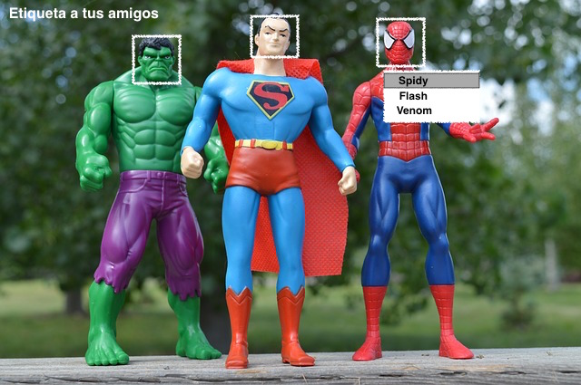
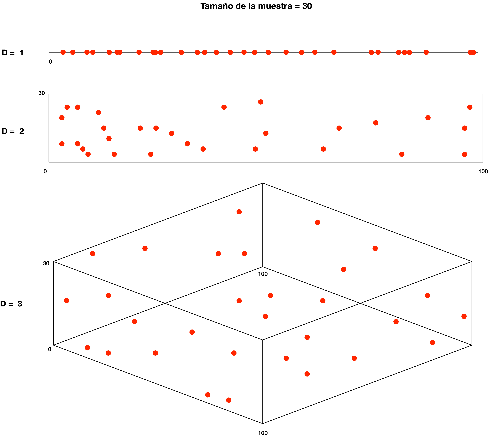

Esta sección tiene como objetivo que tengas una visión general acerca de las áreas de investigación, aplicaciones y tecnologías que involucran la extracción de conocimiento a partir de grandes cantidades de datos. Para esto veremos:
* Que buscamos en los datos.
* El proceso del descubrimiento de conocimiento en bases de datos.
* Las tecnologías que intervienen en el proceso.
* Las técnicas de minería de datos que aprenderás a utilizar.
* En que tipo de aplicaciones podemos utilizar minería de datos.  
* Que retos y limitaciones existen actualmente en el área.

## Introducción
Cuando visitamos al médico, confiamos en que el haya adquirido un
amplio **conocimiento** a base de interactuar con su entorno y su
capacidad de procesar la información que lo rodea. Utilizando este
conocimiento él podrá ser capaz de darnos un diagnóstico acertado. Si en
lugar de asistir con un humano eligiéramos visitar a un robot-médico,
más vale que cuente con una buena inteligencia artificial. Según
Rusell y Norvig el término inteligencia artificial se aplica cuando
una máquina imita las funciones cognitivas que nosotros los humanos asociamos con otras mentes humanas, como por ejemplo: *aprender* y *resolver
problemas* [ref]. Precisamente, una de las primeras aplicaciones de la
inteligencia artificial han sido los [Sistemas Expertos](https://en.wikipedia.org/wiki/Expert_system), los cuales
pueden emular la toma de decisiones de un humano experto, tal como
un médico. Un exponente importante de este tipo de sistemas
fue  [Mycin](https://es.wikipedia.org/wiki/Mycin) el cual se basaba
en un sencillo motor de inferencia, que manejaba una
base de conocimiento de aproximadamente unas 500 reglas. Estas
reglas
[representaban el conocimiento](https://es.wikipedia.org/wiki/Representaci%C3%B3n_del_conocimiento) de
los médicos. Una desventaja de este tipo de sistemas era que se
requería de mucho esfuerzo y recursos para extraer el conocimiento de
los expertos. Se debía entrevistarlos utilizando técnicas de
[elicitación del conocimiento](http://web.cs.wpi.edu/~jburge/thesis/kematrix.html) para después [representar dicho
conocimiento](https://es.wikipedia.org/wiki/Representaci%C3%B3n_del_conocimiento) de alguna manera para después almacenarlo en una *base
de conocimiento*. Digamos que se realizaba una extracción manual del
conocimiento a partir de las ideas de los expertos. Cualquier
desarrollador que ha tenido que extraer los requerimientos de un
usuario te dirá que fue una tarea cercana a lo imposible. No es
descabellado preguntarnos entonces: ¿el conocimiento "humano" podrá
ser extraído de otras fuentes?, ¿y si contamos con una base de datos
de miles de diagnósticos realizados anteriormente?, ¿podremos extraer
de esta base de datos un nuevo conocimiento?. Este es el tipo de
preguntas son las que se trata de contestar el área de investigación
en inteligencia artificial, pero como veremos más adelante, en la
búsqueda de respuestas se involucran muchas otras áreas de
investigación.

### Descubrimiento de conocimiento en bases de datos (KDD)
Al proceso de extraer conocimiento útil a partir de datos se le
denomina *Descubrimiento de Conocimiento en Bases de Datos* o *KDD* ya
que es muy común utilizar las siglas en inglés de "Knowledge
Discovery from Databases". Este proceso puede hacerse manualmente,
expertos en algún dominio pueden consultar y analizar bases de datos
para descubrir patrones que les ayuden a tomar decisiones. Por
ejemplo, en la película "The Big Short" podemos ver al inversionista Michael Burry analizando grandes cantidades de datos, para después predecir el eminente desplome de la burbuja inmobiliaria. Como podemos imaginar, este proceso no es trivial, no es simplemente hacer una consulta en una base de datos o en un motor de búsqueda. Es necesario encontrar patrones que involucran diferentes variables y relaciones no lineales entre ellas. El KDD sigue evolucionando involucrando cada vez más áreas de investigación: aprendizaje automático, reconocimiento de patrones, computación inteligente, estadística, procesamiento de lenguaje natural, visualización, ingeniería de software entre otras.

La Minería de Datos de hecho es uno de los componentes del proceso KDD.
Veamos el proceso del KDD, según el esquema de Brachman y Anand:


1. Como primer paso debemos *identificar el objetivo* del proceso de
   KDD. Por ejemplo, un proveedor de telefonía móvil podría estar
   interesado en identificar a aquellos clientes que ya no renovarán
   su contrato y se irán con la competencia. A esto se le llama la
   tasa de cancelación de clientes (en
   inglés [churn rate](https://en.wikipedia.org/wiki/Churn_rate) o
   attrition rate) y es crucial para estimar el desempeño de la
   empresa.

2. El siguiente paso es *seleccionar y recolectar* aquellos datos
   necesarios para el proceso. Para nuestro ejemplo, podríamos
   requerir el historial de pago de los clientes, datos sobre quejas y
   llamadas que han hecho a soporte, servicios adicionales que se han
   contratado o cancelado, etc. Esta información puede estar
   distribuida en diferentes bases de datos. También se puede incluir
   información que se colecte por medio de sensores o sistemas
   externos, por ejemplo lecturas del GPS, caídas de la conexión o el
   número de aplicaciones que el cliente se ha instalado.

3. Es necesario *preprocesar* los datos para limpiarlos de datos
   erróneos, datos faltantes, cambios de formato, inconsistencias,
   etc. Esto proceso complicado y depende bastante de los
   requerimientos de la empresa.

4. Dependiendo de los objetivos se deben *transformar* los datos para simplificar su procesamiento. Por ejemplo un documento de texto es necesario transformarlo en vector representativo. Una imagen puede ser transformada en una representación simplificada pero conservando sus características esenciales. Muchas veces también es necesario eliminar campos que no aportan mucho a la tarea de KDD. Siguiendo nuestro ejemplo, después de un análisis podríamos darnos cuenta que el número de teléfono en sí no es un dato importante para distinguir el comportamiento de los clientes, y que al contrario la marca y modelo de sus móviles son muy importantes.

5. Este paso consiste en *seleccionar la tarea de minería de datos* adecuado de acuerdo con la meta establecida para el proceso de KDD. Por ejemplo, clasificación, regresión, agrupamiento, etc.

6. Se hace un *análisis exploratorio*, podemos experimentar con diferentes  algoritmos de minería de datos o de aprendizaje automático. Al seleccionar los algoritmos debemos considerar los tipos de datos que tenemos. Por ejemplo algunos algoritmos no son apropiados para datos categóricos (modelo de celular). También debemos ajustar los parámetros para mejorar el desempeño y comparar el rendimiento entre los algoritmos.

7. En este paso se realiza la *minería de datos* a partir de el o los algoritmos seleccionados en el paso anterior.

Este paso nos arroja los *patrones ocultos* que describen a los
datos. Siguiendo nuestro ejemplo, el resultado podría ser un conjunto
de reglas nos que pueden servir para decidir si un cliente cancelará
su subscripción. Una de las regla podría ser:

```
    SI el cliente tiene un promedio mayor a 7 días de retraso
      AND su promedio de llamadas al mes es menor que 10
    ENTONCES:
         el cliente cancelara el servicio
```
Los patrones son entonces Modelos que se ajustan a los datos. Los modelos no siempre están expresados en un lenguaje que los humanos podamos entender. Por ejemplo el resultado de un algoritmo de agrupamiento podrían ser simplemente grupos de clientes, que después deberíamos de interpretar.

En el texto utilizaremos el término modelo en lugar de patrones, ya que es más usual actualmente. Algo muy importante es que los modelos deben de representar también a datos nuevos. Digamos nuevos clientes que se subscriban el mes siguiente.       

8. En este paso nos toca *interpretar y evaluar* los patrones que encontramos en el paso anterior. Visualizar los patrones y modelos extraídos. Decidir si se ha encontrado algún conocimiento útil.

9. El último paso es hacer algo con el conocimiento adquirido. Se puede utilizar directamente para tomar decisiones, incorporarlo como parte de un sistema o simplemente reportar los resultados a los interesados.


## Algunas definiciones y Tecnologías Complementarias

### Minería de datos
El libro se enfocará principalmente en el componente de Minería de Datos, que como vimos es un paso importante en el proceso de KDD. Pero también te haz dado cuenta que es muy importante hacer bien los pasos anteriores. De hecho en la mayoría de los proyectos los otros pasos requieren de mayor trabajo. La minería de datos entonces podemos definirla como: El proceso de búsqueda de patrones aplicando distintos algoritmos a grandes cantidades de datos. Algunas veces se utiliza el término Minería de Datos para referirse a todo el proceso de KDD.

### Aprendizaje automático (Machine Learning)
El aprendizaje automático es el área de las ciencias computacionales encargada de estudiar y desarrollar los algoritmos capaces de aprender y hacer predicciones a partir de los datos. Podríamos decir que en el proceso de vamos a aplicar algoritmos de aprendizaje automático, por lo que debemos conocer muy bien sus fundamentos y limitaciones.

### Ciencia de datos
Como hemos visto el proceso de KDD busca extraer conocimiento partir de los datos. ¿Y si vamos más allá?. La ciencia de datos es similar al KDD pero el conocimiento que se busca es el conocimiento científico. Es hacer ciencia a partir de los datos. La ciencia apoyada en datos (en inglés data-driven science) al igual que el KDD es una campo interdisciplinario que incluye métodos científicos, procesos, y sistemas para extraer conocimiento o entendimiento a partir de los datos.

### Computación inteligente
La expresión computación inteligente (CI de computational intelligence) se asocia a la habilidad de un sistema de computo de aprender a realizar una tarea a partir de datos o la observación. Una distinción importante es que los métodos empleados son inspirados en la naturaleza. La CI busca resolver problemas complejos del mundo-real para los cuales el modelado tradicional o matemático son insuficientes. Los métodos más representativos son: redes neuronales artificiales, lógica difusa y computación evolutiva.


### Big Data
Big Data se refiere al caso de sistemas que cuentan con cantidades enormes de datos. Normalmente los datos se almacenan en un servidor central. En el caso de Big Data los datos son tantos que deben almacenarse en muchos servidores. También el tipo de dato podría ser muy grande, por ejemplo un registro de un experimento determinado podría medir un terabyte. En estos casos las técnicas o algoritmos tradicionales resultan inadecuados. El usar Big Data no implica Minería de Datos, muchos sistemas solamente requieren procesar los datos, por ejemplo para realizar una consulta o algún calculo. Claro que también hay procesos de Minería de Datos que se realizan utilizando Big Data, esto requiere de tecnología y algoritmos especializados.

## Algunas Aplicaciones

### Modelado de sistemas no lineales
En general se utiliza la Minería de Datos para modelar sistemas no lineales. En caso de que no estés familiarizado veamos un ejemplo. Ana entra a trabajar a las 7:00 am. El trabajo de Ana está a 10 km de su casa. Ella normalmente sale de su casa a las 6:20 y llega a las 6:40, hace 20 minutos. En ocasiones sale a las 6:10 y  claro llega a las 6:30. Hasta aquí todo va bien, los tiempos siguen un comportamiento lineal y constante. Incluso podemos calcular que si antes deja a sus hijos en la escuela que está a 5 km, llegará en 10 minutos. El problema viene cuando Ana sale de casa a las 6:25 en ese caso hace 25 minutos y si sale a las 6:30 hace 40 minutos y llega tarde a su trabajo. ¿Por que el sistema no sigue un comportamiento lineal?. El problema es que el tiempo que hace a su trabajo no solo depende de la velocidad promedio y la distancia. El tiempo depende del tráfico, la ruta que tome, si se pone un policía a dirigir el tráfico, si hay alguna manifestación, si las primarias están de vacaciones, etc. El problema se vuelve no lineal por que está ubicado en el mundo real, y si queremos hacer un calculo más exacto tendríamos que considerar muchas variables, incluso podríamos hacer un simulador. Cuando salimos a nuestro trabajo muchos hacemos un cálculo mental del tiempo que haremos por eso los optimistas llegamos tarde. Pero, ¿en que basamos nuestro cálculo si el sistema es no lineal y por lo tanto muy complejo?. Así es, en nuestra experiencia, es decir en extraer de nuestra mente el tiempo que hemos hecho los días anteriores, de nuestro sentido común "hoy es viernes, habrá mucho tráfico". La minería de datos puede ayudarnos a modelar este tipo de sistemas, sin que tengamos nosotros que establecer las relaciones no lineales entre muchas variables.

### El Ruido
El ruido es una complicación común en sistemas del mundo-real. Por ejemplo, cuando se le pone un sensor a un paciente, en ocasiones las lecturas se ven afectadas por los movimientos del paciente y registran valores erróneos o muy altos o bajos en comparación con el valor real. Descubrir patrones en presencia de ruido es bastante difícil, por lo que se deben elegir técnicas de modelado que toleren el ruido.     

### Internet de las Cosas
El concepto de Internet de las Cosas (IoT) se refiere básicamente a que todas las cosas están conectadas al Internet y pueden recopilar e intercambiar datos. Crear modelos de sistemas no lineales con muchísimas variables es muy complicado. La tecnología de IoT se puede aplicar en sistemas de ciudades inteligentes, para agilizar el tráfico en tiempo real o abrir el paso a los bomberos cuando se dirigen a atender una emergencia. Estos sistemas deben considerar las lecturas en tiempo real de muchísimos sensores y determinar como se afectan entre sí, para determinar si hay alguna emergencia grave, predecir el tráfico. Utilizando técnicas de aprendizaje automático es posible modelar este tipo de sistemas.

   

### Reconocimiento de patrones en multimedia
Al momento de subir a Facebook la tradicional *selfie* con los amigos, el sistema nos sugiere etiquetar las caras de ellos con su nombre de usuario correcto. Es decir, el sistema reconoció al usuario a partir de la imagen una imagen de rostro. Esto es parecido a lo que hicimos anteriormente con las flores Iris. Pero en lugar de 4 variables de entrada tenemos un arreglo de los cientos de pixeles que hacen la imagen y en lugar de tres flores, tenemos cientos de amigos. En el caso de las flores recordamos que ya estaban etiquetadas. En el caso de Facebook, la extracción del modelo requiere que ya haya ejemplos de los rostros asociados a los usuarios. Nosotros mismos agregamos ejemplos clasificados cada que manualmente etiquetamos un rostro. Las mismas técnicas pueden utilizarse para reconocer gestos, la voz, huellas digitales, firmas, letra escrita, copias de videos y muchos otros patrones.  



### Negocios
Se utiliza el KDD principalmente para el mercadeo dirigido, para calcular el riesgo de alguna operación, predecir cambios en los mercados, identificar tendencias a partir de las publicaciones en redes sociales, recomendar productos o personalizar servicios.   

# Minería de Textos
Resumen de correos, noticias.
Análisis de Sentimientos.

### Ciencia
POR HACER

## Tareas de la minería de datos

### Clasificación
Un problema muy común es el de asignar un objeto a una clase o categoría. Veamos varios ejemplos. Los correos electrónicos que recibimos podemos clasificarlos en dos clases: *correo válido* o *correo no deseado*. Actualmente en Google Mail hay otras categorías: *social*, *promociones*, *Foros*. La noticia de un periódico: *deportes*, *nacional*, *internacional*. Un usuario visitando una tienda en-línea: *compra*, *no-compra*. Una imagen de dígitos escritos a mano: *0*,*1*,*2*,*3*,*4*,*5*,*6*,*7*,*8*,*9*. La imagen de una [galaxia](https://www.galaxyzoo.org/): *suave*,*disco*,*estrella*. La imagen de una persona: *ana*, *tom*, *joe*, *sue*, etc. El problema de Clasificación es el de identificar a que clase pertenece un objeto, basándose en un conjunto de objetos en los cuales la clase o categoría ya se conoce. Por ejemplo para el caso del la clasificación de correos electrónicos, primero debemos contar con un buen número de correos que han sido clasificados previamente por humanos. A partir de estos datos un algoritmo de clasificación es capaz de aprender un modelo que podemos utilizar después para clasificar nuevos correos que nos lleguen. La tarea entonces es predecir una clase o etiqueta a partir de un conjunto de características.

### Regresión
La Regresión es la misma tarea de la clasificación pero en lugar de asignarle una clase a cada instancia le asignamos un valor continuo. Por ejemplo, las instancias podrían ser casas y la variable objetivo podría ser el costo de venta en el mercado. De nuevo para hacer la predicción nos basamos en un conjunto de casas que ademas de tener valores en todas las características cuentan también con el precio de venta.

#### Objetivo del Aprendizaje Supervisado
El objetivo de la Clasificación y la Regresión es el de minimizar el error de predicción. El error es la diferencia que hay entre el valor o categoría reales y la predicción. Este es un tema muy importante que veremos en la sección de [Evaluación de Modelos]. Las dos tareas entonces son ejemplos de aprendizaje supervisado ya que requieren de datos de entrenamiento para extraer de ahí el modelo o la predicción directamente.

### Agrupamiento
El agrupamiento es un ejemplo de Aprendizaje no supervisado en el cual no se requiere de contar con datos previamente clasificados. El objetivo del análisis de Agrupamiento o *Clustering* es el de encontrar grupos de objetos los cuales estén estrechamente relacionados o sean similares. El objetivo en este caso es tratar de que la distancia promedio entre los miembros del mismo grupo sea menor que la distancia promedio entre objetos de distintos grupos. Por ejemplo, un sistema de [recuperación de información](https://es.wikipedia.org/wiki/B%C3%BAsqueda_y_recuperaci%C3%B3n_de_informaci%C3%B3n) puede regresar los documentos de una búsqueda con mayor eficiencia si los documentos similares se guardan juntos. También podemos encontrar a clientes similares a los cuales les podríamos ofrecer ciertos servicios.  

### Análisis de asociación
En ocasiones podemos descubrir patrones interesantes los cuales asocian hechos que con frecuencia suceden al mismo tiempo o en cierto orden. En México por ejemplo podríamos encontrar que si un consumidor compra cebollas y tomate al mismo tiempo, es muy probable que también compre carne. Es muy probable que las tortillas las compre siempre. Normalmente los patrones de asociación se expresan como reglas de asociación. Para el ejemplo anterior la reglas sería:

{cebollas, tomate} -> {carne}   

Este tipo de análisis se utiliza para hacer toma de decisiones de marketing, ubicación de artículos en aparadores, ofrecer agregar algún producto al carrito de compra, entre otros.

### Detección de anomalías
El objetivo de esta tarea es encontrar objetos que sean muy diferentes al resto. A este tipo de objetos se les conoce como anomalías o outliers. El reto es no etiquetar como anomalías a objetos que no lo son y viceversa. Este tipo de análisis nos permite detectar fraudes con las tarjetas de crédito, robo de identidad, ciertas enfermedades, problemas en ecosistemas entre otras aplicaciones.  

### Optimización
La optimización no es en si misma una tarea de la minería de datos, pero la mayoría de las técnicas que se utilizan para realizar las tareas anteriormente  utilizan algoritmos de optimización. Un algoritmo de optimización podemos verlo como un algoritmo de búsqueda. Tratamos de encontrar una combinación de objetos que nos resuelva un problema de manera óptima. En este libro nos enfocaremos en algoritmos de optimización inspirados en la naturaleza. 

#### ¿Buscar o Inferir Patrones?
Hay casos en los que un algoritmo de optimización puede utilizarse para hacer minería de datos. El problema de extracción de conocimiento podemos verlo como la  búsqueda del modelo óptimo de para los datos en cuestión. Por ejemplo debemos buscar el conjunto de reglas que mejor clasifique ciertos correos electrónicos. Es importante recordar que la extracción de conocimiento no siempre se basa en inferencia estadística.    

 
## Los Retos
Tan, Steinbach y Kumar mencionan los principales retos que han motivado el desarrollo de la minería de datos:

* **Escalabilidad.** Actualmente contamos con inmensas cantidades de datos. No es raro utilizar conjuntos de datos que rondan en los terabytes o incluso petabytes. Los algoritmos, estructuras y bases de datos deben ser capaces de escalar a los niveles del *Big Data*. Esto sigue siendo un reto, que involucra otras áreas como el computo distribuido y paralelo, cómputo en la nube. Además se deben de utilizar técnicas de muestreo.

* **Alta Dimensión.** Hace algunos años era inconcebible tener objetos con miles de características. Ahora este tipo de instancias son comunes. Si un objeto tuviera solo dos o tres características lo podríamos representar en 2D o en 3D un eje por cada una. Pero cuando un objeto tiene muchas características y sobrepasa por mucho el 3D decimos que se encuentra en un espacio de alta dimensión. Podríamos imaginarnos que el espacio donde se encuentra ubicado el objeto es cada vez mayor por cada nueva dimensión que agreguemos y comparativamente el número de objetos que cabrían en ese espacio sería muchísimo mayor. A este fenómeno se le conoce como la [maldición de la dimensión](https://es.wikipedia.org/wiki/Maldici%C3%B3n_de_la_dimensi%C3%B3n) pues el volumen del espacio aumenta exponencialmente haciendo que los datos disponibles se vuelvan dispersos. El reto es que algunos algoritmos de análisis de datos no dan buenos resultados al trabajar en altas dimensiones.



* **Datos Heterogéneos y Complejos.** Los datos que tradicionalmente se han empleado en análisis de datos son los categóricos o continuos. En la actualidad se contamos con datos muy diversos como documentos, páginas web, videos, lecturas de sensores, datos con georreferenciación, series de tiempo, grafos, secuencias DNA entre muchos otros. Los algoritmos deben considerar las relaciones y propiedades intrínsecas a los datos, relaciones temporales, propiedades de los grafos, etc.


## Resumen

## Ejercicios

## Lectura adicional
[Visión General de KDD](http://www.kdnuggets.com/gpspubs/aimag-kdd-overview-1996-Fayyad.pdf)

[KD Nuggets](http://www.kdnuggets.com/) Es un sitio con mucha información relacionada con minería de datos y KDD.  

## Bibliografía
