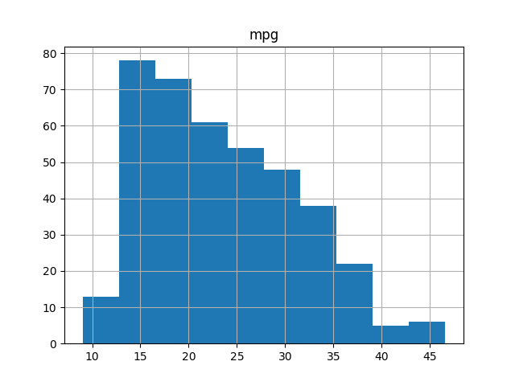

# Preprocesamiento
En esta etapa vamos a procesar los objetos crudos a representaciones favorables para los algoritmos que utilizaremos más adelante. También es conveniente el reducir en los posible la cantidad de datos y los atributos de los objetos para reducir el costo computacional. Para lograr lo anterior, en la etapa de preprocesamiento realizar algunas de estas tareas:

* Estandarización
* Normalización
* Codificación de atributos categóricos
* Agregación
* Muestreo
* Reducción de la dimensión
* Creación de características
* Transformación de atributos


## Estandarización
Muchos algoritmos de aprendizaje automático requieren que los datos estén normalizados para funcionar correctamente. Vamos a entender la razón por medio de un ejemplo. Vamos a observar de nuevo los datos de auto-mpg:

``` python
>>> import numpy as np
>>> import pandas as pd
>>> import matplotlib.pyplot as plt
>>> auto_mpg = pd.read_csv('datos-ejemplo/auto-mpg.data', sep='\s+',
     header=None,  na_values='?', names=['mpg','cylinders','displacement','horsepower',
        'weight','acceleration','model_year','origin','car_name'],
     dtype={'mpg':'f4', 'cylinders':'i4',
        'displacement':'f4','horsepower':'f4','weight':'f4',
        'acceleration':'f4','model_year':'i4','origin':'category',
        'car_name':'category'})

>>> auto_mpg["origin"].cat.categories = ["USA", "Japan", "Germany"]
>>> auto_mpg.tail(3)
      mpg  cylinders  displacement  horsepower  weight  acceleration  \
395  32.0          4         135.0        84.0  2295.0          11.6   
396  28.0          4         120.0        79.0  2625.0          18.6   
397  31.0          4         119.0        82.0  2720.0          19.4   

     model_year origin       car_name  
395          82    USA  dodge rampage  
396          82    USA    ford ranger  
397          82    USA     chevy s-10  
```
Nos vamos a concentrar en dos atributos: *weight* y *mpg*, vamos a graficar a los objetos:

``` python
>>> auto_mpg.plot.scatter(x='weight', y='mpg');
>>> plt.show()
```


Nos damos cuenta al observar la gráfica (o la tabla) que los valores numéricos son muy distintos, una diferencia de 20 unidades en el caso de mpg es mucha, mientras que en el peso no es así. 

Ahora veamos como están distribuidos los valores utilizando un histograma:

``` python
>>> auto_mpg.hist(column='weight');
>>> plt.show()
```

``` python
>>> auto_mpg.hist(column='mpg');
>>> plt.show()
```

