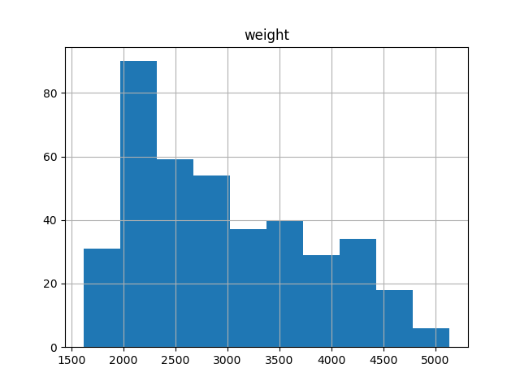
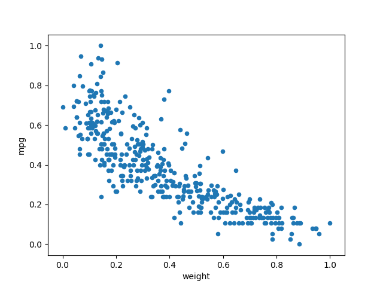

# Preprocesamiento
En esta etapa vamos a procesar los objetos crudos a representaciones favorables para los algoritmos que utilizaremos más adelante. También es conveniente el reducir en los posible la cantidad de datos y los atributos de los objetos para reducir el costo computacional. Para lograr lo anterior, en la etapa de preprocesamiento realizar algunas de estas tareas:

* Estandarización
* Normalización
* Codificación de atributos categóricos
* Agregación
* Muestreo
* Reducción de la dimensión
* Creación de características
* Transformación de atributos


## Estandarización
Muchos algoritmos de aprendizaje automático requieren que los datos estén normalizados para funcionar correctamente. Vamos a entender la razón por medio de un ejemplo. Vamos a observar de nuevo los datos de auto-mpg:

``` python
>>> import numpy as np
>>> import pandas as pd
>>> import matplotlib.pyplot as plt
>>> auto_mpg = pd.read_csv('datos-ejemplo/auto-mpg.data', sep='\s+',
     header=None,  na_values='?', names=['mpg','cylinders','displacement','horsepower',
        'weight','acceleration','model_year','origin','car_name'],
     dtype={'mpg':'f4', 'cylinders':'i4',
        'displacement':'f4','horsepower':'f4','weight':'f4',
        'acceleration':'f4','model_year':'i4','origin':'category',
        'car_name':'category'})

>>> auto_mpg["origin"].cat.categories = ["USA", "Japan", "Germany"]
>>> auto_mpg.tail(3)
      mpg  cylinders  displacement  horsepower  weight  acceleration  \
395  32.0          4         135.0        84.0  2295.0          11.6   
396  28.0          4         120.0        79.0  2625.0          18.6   
397  31.0          4         119.0        82.0  2720.0          19.4   

     model_year origin       car_name  
395          82    USA  dodge rampage  
396          82    USA    ford ranger  
397          82    USA     chevy s-10  
```
Nos vamos a concentrar en dos atributos: *weight* y *mpg*, vamos a graficar a los objetos:

``` python
>>> auto_mpg.plot.scatter(x='weight', y='mpg');
>>> plt.show()
```


Nos damos cuenta al observar la gráfica (o la tabla) que los valores numéricos son muy distintos, una diferencia de 20 unidades en el caso de mpg es mucha, mientras que en el peso no es así.

Ahora veamos como están distribuidos los valores utilizando un histograma:

``` python
>>> auto_mpg.hist(column='weight');
>>> plt.show()
```

``` python
>>> auto_mpg.hist(column='mpg');
>>> plt.show()
```


Si te fijas algunos valores se repiten más que otros, por ejemplo en el caso de las millas por galón vemos que un auto con 40 mpg es mucho menos probable que uno con 20 mpg. Si asumimos que los valores siguen una distribución normal podríamos calcular la probabilidad de tener 10, 30 o 40 mpg, si conocemos la media y la desviación estándar. Esto se simplifica bastante si los datos siguen una distribución normal estandarizada, es decir una distribución normal con una media de 0 y una desviación estándar de 1.  

Para transformar los datos que tenemos solo debemos de utilizar la siguiente ecuación:

```
Z = (X – μ)/σ
```

Es decir el *z-score* para un valor X es X menos la  media(μ) de X, dividido entre la desviación estándar(σ) de X.

Podemos observar gráficamente esta distribución:

``` python
>>> import math
>>> import matplotlib.mlab as mlab

>>> mu = 0
>>> variance = 1
>>> sigma = math.sqrt(variance)
>>> x = np.linspace(mu - 3*sigma, mu + 3*sigma, 100)
>>> plt.plot(x,mlab.normpdf(x, mu, sigma))
>>> plt.show()
```


Podemos estandarizar los datos utilizando la biblioteca sci-kitlearn:

``` python
>>> from sklearn import preprocessing
>>> datos = auto_mpg.loc[ :, ['mpg','weight']]
>>> datos_estandarizados = preprocessing.scale(datos)
>>> df = pd.DataFrame(datos_estandarizados)
>>> df.plot.scatter(x='weight', y='mpg');
>>> plt.show()
```


Vemos que ahora los valores numéricos no son tan distintos y en el caso del histograma de mpg:

``` python
>>> df.hist(column='mpg');
>>> plt.show()
```


Nos damos cuenta que los datos siguen una distribución sesgada a la izquierda cuando la comparamos con la distribución normalizada anteriormente.   

En muchos casos vamos a realizar este proceso en varios conjuntos de datos, por lo que el modulo *preprocessing* nos brinda la clase *StandardScaler* para calcular la media y desviación estándar en un conjunto de entrenamiento para después hacer la misma estandarización en el conjunto de datos de prueba.

### Escalado a un rango

Otra transformación que podemos hacer para *weight* y *mpg*, es cambiar la  escala de los valores a un rango entre cero y uno. Podemos hacerlo de la siguiente manera:


``` python
>>> datos = auto_mpg.loc[ :, ['mpg','weight']]
>>> min_max_scaler = preprocessing.MinMaxScaler()
>>> datos_minmax = min_max_scaler.fit_transform(datos)
>>> df = pd.DataFrame(datos_minmax,columns=['mpg','weight'] )
>>> df.plot.scatter(x='weight', y='mpg');
>>> plt.show()
```


### Escalado con valores atípicos

Ver una comparación entre diferentes tipos de escalado en la documentación de [scikit-learn](http://scikit-learn.org/stable/auto_examples/preprocessing/plot_all_scaling.html#sphx-glr-auto-examples-preprocessing-plot-all-scaling-py)
