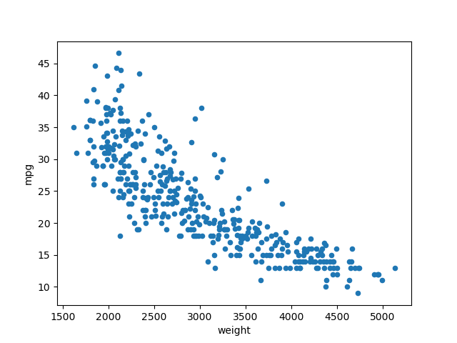
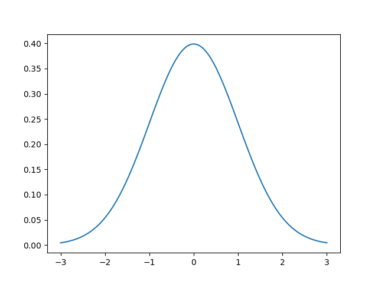
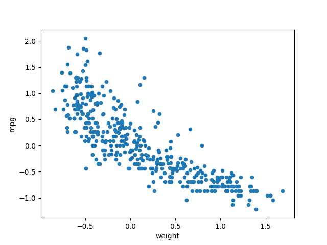

# Preprocesamiento
En esta etapa vamos a procesar los objetos crudos a representaciones favorables para los algoritmos que utilizaremos más adelante. También es conveniente el reducir en los posible la cantidad de datos y los atributos de los objetos para reducir el costo computacional. Para lograr lo anterior, en la etapa de preprocesamiento realizar algunas de estas tareas:

* Estandarización
* Normalización
* Codificación de atributos categóricos
* Agregación
* Muestreo
* Reducción de la dimensión
* Creación de características
* Transformación de atributos


## Estandarización
Muchos algoritmos de aprendizaje automático requieren que los datos estén normalizados para funcionar correctamente. Vamos a entender la razón por medio de un ejemplo. Vamos a observar de nuevo los datos de auto-mpg:

``` python
>>> import numpy as np
>>> import pandas as pd
>>> import matplotlib.pyplot as plt
>>> auto_mpg = pd.read_csv('datos-ejemplo/auto-mpg.data', sep='\s+',
     header=None,  na_values='?', names=['mpg','cylinders','displacement','horsepower',
        'weight','acceleration','model_year','origin','car_name'],
     dtype={'mpg':'f4', 'cylinders':'i4',
        'displacement':'f4','horsepower':'f4','weight':'f4',
        'acceleration':'f4','model_year':'i4','origin':'category',
        'car_name':'category'})

>>> auto_mpg["origin"].cat.categories = ["USA", "Japan", "Germany"]
>>> auto_mpg.tail(3)
      mpg  cylinders  displacement  horsepower  weight  acceleration  \
395  32.0          4         135.0        84.0  2295.0          11.6   
396  28.0          4         120.0        79.0  2625.0          18.6   
397  31.0          4         119.0        82.0  2720.0          19.4   

     model_year origin       car_name  
395          82    USA  dodge rampage  
396          82    USA    ford ranger  
397          82    USA     chevy s-10  
```
Nos vamos a concentrar en dos atributos: *weight* y *mpg*, vamos a graficar a los objetos:

``` python
>>> auto_mpg.plot.scatter(x='weight', y='mpg');
>>> plt.show()
```


Nos damos cuenta al observar la gráfica (o la tabla) que los valores numéricos son muy distintos, una diferencia de 20 unidades en el caso de mpg es mucha, mientras que en el peso no es así.

Ahora veamos como están distribuidos los valores utilizando un histograma:

``` python
>>> auto_mpg.hist(column='weight');
>>> plt.show()
```

``` python
>>> auto_mpg.hist(column='mpg');
>>> plt.show()
```


Si te fijas algunos valores se repiten más que otros, por ejemplo en el caso de las millas por galón vemos que un auto con 40 mpg es mucho menos probable que uno con 20 mpg. Si asumimos que los valores siguen una distribución normal podríamos calcular la probabilidad de tener 10, 30 o 40 mpg, si conocemos la media y la desviación estándar. Esto se simplifica bastante si los datos siguen una distribución normal estandarizada, es decir una distribución normal con una media de 0 y una desviación estándar de 1.  

Para transformar los datos que tenemos solo debemos de utilizar la siguiente ecuación:

```
Z = (X – μ)/σ
```

Es decir el *z-score* para un valor X es X menos la  media(μ) de X, dividido entre la desviación estándar(σ) de X.

Podemos observar gráficamente esta distribución:

``` python
>>> import math
>>> import matplotlib.mlab as mlab

>>> mu = 0
>>> variance = 1
>>> sigma = math.sqrt(variance)
>>> x = np.linspace(mu - 3*sigma, mu + 3*sigma, 100)
>>> plt.plot(x,mlab.normpdf(x, mu, sigma))
>>> plt.show()
```



Podemos estandarizar los datos utilizando la biblioteca sci-kitlearn:

``` python
>>> from sklearn import preprocessing
>>> datos = auto_mpg.loc[ :, ['mpg','weight']]
>>> datos_estandarizados = preprocessing.scale(datos)
>>> df = pd.DataFrame(datos_estandarizados)
>>> df.plot.scatter(x='weight', y='mpg');
>>> plt.show()
```


Vemos que ahora los valores numéricos no son tan distintos y en el caso del histograma de mpg:

``` python
>>> df.hist(column='mpg');
>>> plt.show()
```


Nos damos cuenta que los datos siguen una distribución sesgada a la izquierda cuando la comparamos con la distribución normalizada anteriormente.   

En muchos casos vamos a realizar este proceso en varios conjuntos de datos, por lo que el modulo *preprocessing* nos brinda la clase *StandardScaler* para calcular la media y desviación estándar en un conjunto de entrenamiento para después hacer la misma estandarización en el conjunto de datos de prueba.

### Escalado a un rango

Otra transformación que podemos hacer para *weight* y *mpg*, es cambiar la  escala de los valores a un rango entre cero y uno. Podemos hacerlo de la siguiente manera:


``` python
>>> datos = auto_mpg.loc[ :, ['mpg','weight']]
>>> min_max_scaler = preprocessing.MinMaxScaler()
>>> datos_minmax = min_max_scaler.fit_transform(datos)
>>> df = pd.DataFrame(datos_minmax,columns=['mpg','weight'] )
>>> df.plot.scatter(x='weight', y='mpg');
>>> plt.show()
```


Para escalar a otros rangos enviamos una tupla en el constructor, por ejemplo:

``` python
>>> min = -1
>>> max = 1
>>> min_max_scaler = preprocessing.MinMaxScaler( feature_range=(min, max))
```
### Escalado con valores atípicos

En caso de que los datos que estamos procesando incluyan valores atípicos, debemos utilizar una función de escalado que utilice una estadística que tolere a los *outliers*. Una estrategia es utilizar la mediana y escalar los datos de acuerdo a rangos establecidos por los percentiles. En el caso de el *RobustScaler* de scikit-learn por defecto se utiliza el rango entre el primer (percentil 25) y tercer (percentil 75) cuartiles.

``` python
>>> datos = auto_mpg.loc[ :, ['mpg','weight']]
>>> robust_scaler = preprocessing.RobustScaler()
>>> datos_robustos  = robust_scaler.fit_transform(datos)
>>> df = pd.DataFrame(datos_robustos,columns=['mpg','weight'] )
>>> df.plot.scatter(x='weight', y='mpg');
<matplotlib.axes._subplots.AxesSubplot object at 0x11f5e6050>
>>> plt.show()
```


# Normalización

# Datos Agregados
Imagina que eres el ejecutivo de una cadena de librerías y tienes que tomar decisiones a cerca de los productos que se deben de promover en la siguiente temporada. Para apoyarte en la toma de decisiones utilizas un sistema [OLAP](https://es.wikipedia.org/wiki/OLAP)  el cual te permite ver los datos de las ventas con distintos nivel de detalle. Puedes ir desde el nivel de granularidad más bajo:

|  Producto      |  Cantidad | Tienda | Ciudad |  Pais |  Fecha   | Mes | Año|
|----------------|-----------|--------|--------|-------|----------|-----|----|  
|  El Principito |     3     |  123   |  LA    |  USA  | 10/02/16 | FEB |2016|  
|  El Principito |     0     |  156   |  LA    |  USA  | 10/02/16 | FEB |2016|
|  El Hobbit     |     5     |  123   |  LA    |  USA  | 10/02/16 | FEB |2016|
|  El Hobbit     |     1     |  156   |  LA    |  USA  | 10/02/16 | FEB |2016|

Lo que vemos son las ventas diarias de cada libro en cada tienda. Como la información es muy detallada prefieres verla a otro nivel de detalle, por ejemplo:

|  Producto      |  Cantidad  | Ciudad   | Pais   |  Mes  | Año|
|----------------|------------|----------|--------|-------|----|  
|  El Principito |     10     |   LA     |  USA   | ENE   |2016|
|  El Principito |     30     |   LA     |  USA   | FEB   |2016|
|  El Hobbit     |     30     |   LA     |  USA   | ENE   |2016|
|  El Hobbit     |     30     |   LA     |  USA   | FEB   |2016|

Esta vista te presenta los datos agregados por ciudad y mes. Agregar los datos consiste en hacer grupos que coincidan en determinado atributo y realizar alguna operación sobre el grupo, sumarlos en este caso. Podemos agregar todavía más:

|  Producto      |  Cantidad  | Pais     |  Año  |
|----------------|------------|----------|-------|  
|  El Principito |   29,203   | México   | 2016  |
|  El Principito |   29,788   | USA      | 2016  |
|  El Hobbit     |   18,987   | México   | 2017  |
|  El Hobbit     |   36,699   | USA      | 2017  |

Dependiendo del tipo de análisis que estés haciendo será el tipo de agrupación que necesites. Como agregar reduce la cantidad de datos, tenemos las siguientes ventajas:
* Si solo almacenamos los datos agregados, ahorramos espacio de almacenamiento.
* Se reduce el número de atributos.
* Los datos agrupados tienen menor variabilidad.

Los datos agregados tienen mucha importancia en los sistemas de toma de decisiones, almacenes de datos y el concepto de cubos de datos. Para conocer más acerca de estos temas relacionados puedes revisar:

[OLAP](http://okfnlabs.org/blog/2014/01/10/olap-introduction.html)
[Almacenes de Datos]
[Cubos de Datos]
[Esquema Estrella]
