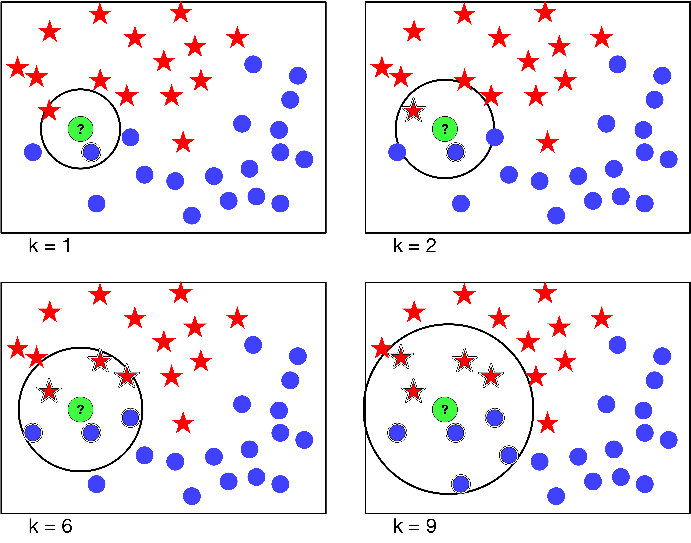
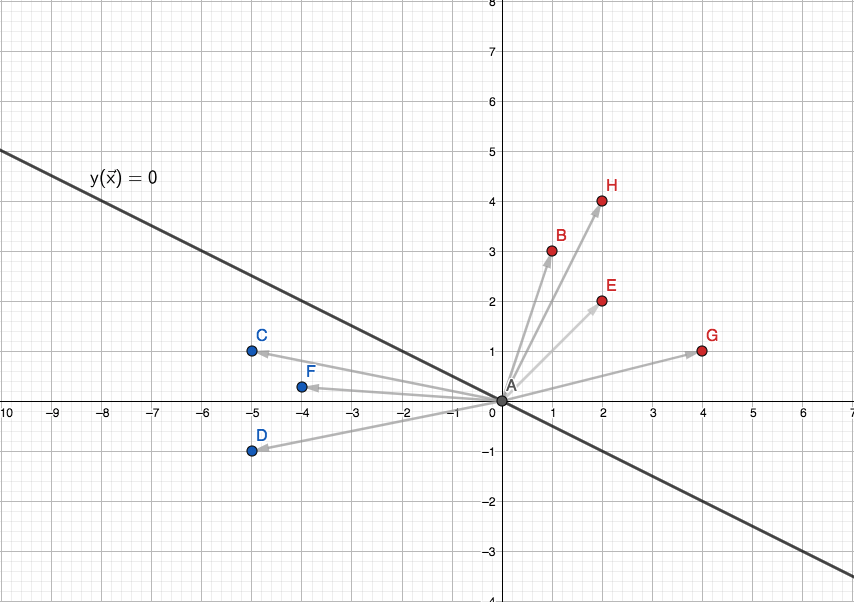
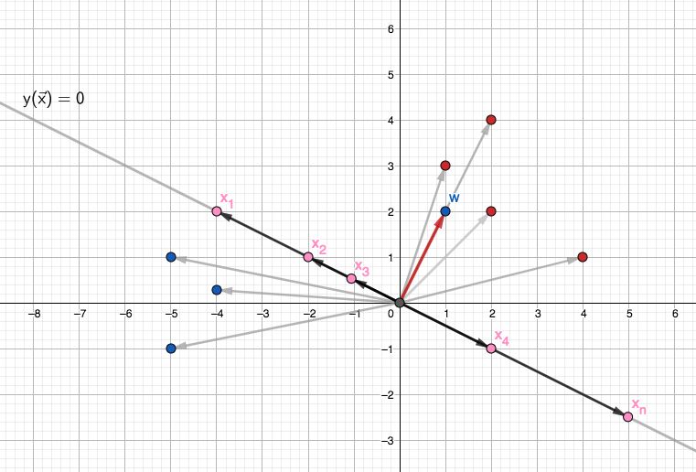
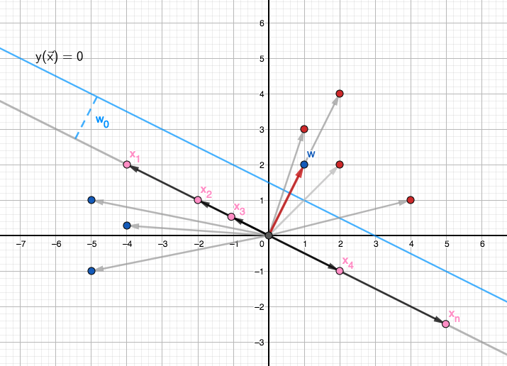
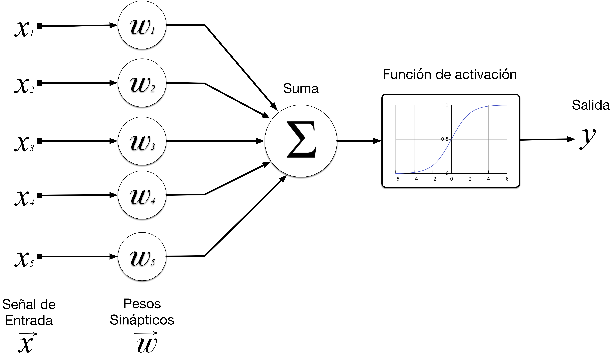

# Otras Técnicas de Clasificación

## Clasificadores basados en reglas

En la sección anterior, el modelo utilizado para clasificar se representaba
como un árbol de decisión. Los clasificadores que veremos a continuación
representan al modelo como conjunto de reglas IF-THEN. Estas reglas son
similares a las condiciones de los nodos de los árboles de decisión, una regla
para clasificar hoteles podría ser:

Regla 1: **IF** *alberca* = *sí* **THEN** *WifiGratis* = *sí*.

Las reglas tienen dos partes:

1. El antecedente o precondición **IF** en la cual hay expresiones
 condicionales sobre los atributos, de manera opcional utilizando operadores
 lógicos, por ejemplo, *alberca* = *sí* OR *estrellas < 5*.

2. El consecuente **THEN** donde se expresa la predicción de la clase o
 categoría a la que pertenece el objeto.

#### Ejemplo

Recordemos el ejemplo de los hoteles visto anteriormente:

| id |  hotel    |estrellas|  alberca  | WiFi Gratis |
|----|-----------|--------:|-----------|------------:|
| 1  | Mariots   |   2     | Sí        | Sí          |
| 2  | Díaz Inn  |   2     | No        | Sí          |
| 3  | Mandarina |   5     | Sí        | No          |
| 4  | Le Hotel  |   3     | Sí        | No          |
| 5  | Halton    |   4     | No        | Sí          |
| 6  | Tromp     |   4     | Sí        | No          |

Un modelo basado en reglas para clasificar a los hoteles puede ser:

R1: IF estrellas = 5 OR estrellas = 3 THEN WiFiGratis = Sí
R2: IF alberca = No THEN WiFiGratis = Sí
R3: IF alberca = Sí THEN WiFiGratis = No

Los algoritmos clasificadores basados en reglas extraen las reglas de los datos mediante:

1. La extracción de reglas a partir de árboles de decisión. Las rutas de la
 raíz a las hojas son las precondiciones las hojas son los consecuentes [@han2011data].

2. Se generan las reglas a partir de los datos, utilizando un algoritmo de
 covertura, por ejemplo RIPPER [@cohen1995fast] o CN2 [@clark1989cn2]:

## $k$ vecinos más próximos

Este algoritmo se basa en una idea sencilla: asignar la clase que tengan los
objetos del conjunto de entrenamiento que más se parezcan al objeto a
clasificar. Para calcular la similaridad entre dos objetos, se puede cualcular
simplmente la distancia euclidiana entre los vectores de características de
cada objeto. El parámetro $k$ especifica cuantos objetos (ordenados por
similaridad) se van a considerar para la asignación. En el caso más sencillo se
le asigna al objeto la clase mayoritaria.

El método es muy fácil de implmentar. La selección del valor de $k$ pude
afectar el desempeño del algoritmo. La figura muestra un ejemplo de
clasificación para distintos valores de %k%. Si elegimos un valor de $k$ muy
pequeño puede ser afectado por el ruido o valores atípicos, por otro lado
valores muy grandes se tenderá a considerar un número mayor de datos con otras
clases. El valor del voto que asigna cada objeto puede ponderarse con respecto
a la distancia.

{ width=50% }

## Naïve Bayes

Este clasificador básico recibe el nombre de Naïve que se traduce al español
como ingenuo. La razón de esto es que considera que los valores de los
atributos de un objeto son variables independientes. Es fácil ver que esta
consideración |no siempre es real. Por ejemplo, para los atributos de un hotel:
"número de estrellas" y "alberca" podemos imaginar que un hotel de más de 4
estrellas es muy probable que cuente con una o más. También es muy probable que
un hotel de dos estrellas |no cuente con una. Entonces, un clasificador Naïve
Bayes considera que para una clase $C$ dado un objeto con los 
atributos $\{A_1,A_2,\dots,A_n\}$ podemos calcular la probabilidad condicional:

$P\{C|A_1,A_2,\dots,A_n\}$

Esto significa tratar de estimar las probabilidades a partir del conjunto de
datos de entrenamiento. Para clasificar un registro se debe de calcular la
probabilidad condicional para cada clase $C_j$ y elegir la mayor:

$P\{C_j|A_1,A_2,\dots,A_n\}=\frac{ P\{A_1,A_2,\dots,A_n|C_j\} \cdot P(C_j)}{P\{A_1,A_2,\dots,A_n\}}$

Como solo estamos interesados en elegir la mejor opción basta con calcular:

$P\{A_1,A_2,\dots,A_n|C_j\}\cdot P(C_j)$

Si consideramos (ingenuamente) los atributos como variables independientes, el primer término se simplifica:

$P\{A_1,A_2,\dots,A_n|C_j\} = P\{A_1|C_j\} \cdot P\{A_2|C_j\} \cdot \cdot \cdot P\{A_n|C_j\}$  

#### Ejemplo 

Como ejemplo vamos a utilizar un fragemento del conjunto de datos de [enfermedades agudas](https://archive.ics.uci.edu/ml/datasets/Acute+Inflammations) y utilizaremos un clasificador Naïve Bayes para determinar si un paciente tienen una inflamación aguda de la vejiga.

Datos:

| temp | nausea | dolor lumbar |  necesidad constante | dolor al orinar | comezón en la uretra | infección |
|------|--------|--------------|----------------------|-----------------|----------------------|-----------|
|35.5|no|yes|no|no|no|no|
|36.0|no|yes|no|no|no|no|
|36.8|no|no|yes|yes|yes|yes|
|37.0|no|no|yes|yes|yes|yes|
|37.4|no|no|yes|no|no|yes|
|37.1|no|no|yes|no|no|yes|
|37.6|no|no|yes|yes|no|yes|
|37.8|no|no|yes|yes|yes|yes|
|38.0|no|yes|yes|no|yes|no|
|39.0|no|yes|yes|no|yes|no|
|40.4|yes|yes|no|yes|no|no|
|40.8|no|yes|yes|no|yes|no|
|41.5|yes|yes|no|yes|no|no|
|41.5|no|yes|yes|no|yes|no|

Paciente:

| temp | nausea | dolor lumbar |  necesidad constante | dolor al orinar | comezón en la uretra | infección |
|------|--------|--------------|----------------------|-----------------|----------------------|-----------|
|36.6   |no     |no            |                   yes|              yes|                   yes|        yes|

Como primer paso vamos a calcular $P(C_j)$:

$P(C_j) = \frac{N}{N_c}$

$P('yes') = 6/14 = 0.429$  

$P('no') = 8/14 = 0.571$

Para calcular los atributos discretos:

$P(A_i|C_k) = \frac{|A_ik|}{N_Ck}$

Donde,

* $|A_ik|$ es el número de registros con el atributo $A_ik$ pertenecientes a la clase  $C_k$
* $N_Ck$ es el número de registros pertenecientes a la clase  $C_k$ 

En la siguiente tabla tenemos las probabilidades de los atributos discretos:

| clase | nausea | dolor lumbar |  necesidad constante | dolor al orinar | comezón en la uretra |
|-------|--------|--------------|----------------------|-----------------|----------------------|
|  yes  |0.14    | 0.57         |                  0.71|             0.43|                   0.5|
|  no   |0.86    | 0.43         |                  0.29|             0.57|                   0.5|

Para el caso de datos continuos hay varias opciones @[tan2007introduction]:

* Se discretiza el rango creando particiones y asignando un solo valor a cada una.
* Se hace una división de dos vías a partir de un valor.
* Se estima la densidad de la probabilidad. 
    * Se asume que los valores siguen una distribución normal.
    * Se utilizan los datos para calcular los parámetros de la distribución.
    * Una vez que se conoce la distribución se puede calcular la probabilidad condicional.

En este caso tenemos al atributo temperatura como atributo continuo.

| clase | media  | stdev        | distribución normal x=36.3   |  
|-------|--------|--------------|------------------------------|
|  yes  | 37.28  | 2.38         |     0.16                     |
|  no   | 39.09  | 0.34         |      0                       | 

Incluso antes de multiplicar las probabilidades vemos que en el atributo "temperatura" la clase "no" tiene cero de probabilidad, por lo que la probabilidad de la clase "yes" será mayor. 

$P(Paciente|No) = 0.86 * 0.43 * 0.29 * 0.57 * 0.5 * 0.16 = 0.0048$

$P(Paciente|Yes) = 0.14 * 0.57 * 0.71 * 0.43 * 0.5 * 0 = 0$

$P(Paciente|No)P(No)= 0.0027$

$P(Paciente|Yes)P(Yes)=0$ 

Como P(Paciente|No)P(No) es mayor, **la clase para el registro Paciente es "yes"**

## Redes Neuronales Artificiales

Las técnicas de clasificación que exploraremos en estos dos capítulos, las
*redes neuronales artificiales* y las *máquinas de vectores de soporte* siguen
una misma idea: encontrar funciones que definan un frontera de decisión. Por
ejemplo, en el caso de un clasificación binaria tendíamos una función que tome
como entrada un vector de características y lo asigne a una de las clases. Para
entender mejor esta idea vamos a empezar primero resolviendo un caso sencillo
de clasificación. Los conjuntos de datos *linealmente separables* son aquellos
que podríamos clasificar simplemente trazando una línea recta y diciendo de
este lado es la clase A y del otro la clase B. Claro, lo de la línea recta solo
sería posible si los datos estuvieran en un espacio de dos dimensiones, es por
eso que de manera general hablamos de *hiperplanos* de $dimensíon-(D-1)$, con
esto es 2D el hiperplano es de 1D (la recta) y en 3D un plano y así
sucesivamente. Una manera de clasificar este tipo de conjuntos de datos es
empleando funciones discriminantes. 

### Funciones Discriminantes

Un discriminante es una función que toma un vector $n$ como entrada y le asigna
una clase. Nos vamos a concentrar solamente en discriminántes lineales,
aquellos para los que la superficie de desción es un hiperplano. También por el
momento atacaremos problemas de clasificación binarios. Una función
discriminante toma como entrada un vector de características:

$y(\vec{x})=\vec{w}^T\vec{x}+w_0$

donde a $\vec{w}$ se le conoce como el *vector de pesos* y a $w_0$ como el
*sesgo* (a $-w_0$ se le conoce también como el *umbral*). Si tenemos dos clases
$C=\{c_1,c_2\}$, podemos decir que si $y(\vec{x}\geq{0})$ se le asigna al
objeto la clase $c_1$ y de lo contrario la clase $c_1$. Veamos a la función
discriminante gráficamente:

{ width=70% } 

En la gráfica vemos la representación vectorial del conjunto de datos, la clase
a la que perteneces esta indicada por el color. Unos de los hiperplanos que
discrimina a dichos objetos se muestra como $y(\vec{x})=0$. Veamos ahora como
se establece este hiperplano en la figura siguiente: 

{ width=70% }

El hiperplano se define por medio del vector de pesos $\vec{w}$ y todos
aquellos vectores que son ortogonales a él. Por ejemplo, en la gráfica
$\vec{w}=(1, 2)$ , si consideramos el vector de entrada $x_2=(-2, 1)$, vemos
que el producto punto entre ambos es igual a cero ya que son otogonales, lo
mismo sería para $x_1, $x_3$, ..., $x_n$ y todos los vectores ortogonales a
$w$. Para cambiar la inclinación del hiperplano solamente tendríamos que
ajustar a los componentes de $\vec{w}$. Ahora evaluemos el vector $\vec(x)=(1,
3)$ en rojo, para esto solo tenemos que calcular de nuevo $\vec(w)^T\vec(x)$,
vemos que el resultado es positivo y para $\vec(x)=(-5, 1)$ es negativo. De
esta manera sin necesidad de mover del origen al hiperplano hemos establecido
una función discriminante con solo encontrar un $\vec{w}$ apropiado. Para
aquellos casos en los que el hiperplano debe moverse del origen, esto se ajusta
con el sesgo $w_0$, como se muestra en la figura, donde el hiperplano, mostrado
en azul, está fuera del origen.

{ width=70% }

El objetivo del entrenamiento en este tipo de clasificadores es resolver un
problema de optimización: encontrar los parámetros $\vec{w}$ y $w_0$ que
minimicen el error de clasificación del conjunto de datos. 

### El perceptrón

Vamos a ver ahora un discriminante lineal de gran importancia histórica, el
perceptrón de [@rosenblatt1962principles]. El aunque perceptrón solo es capaz
de clasificar conjuntos de datos linealmente separables, su desarrollo sentó
las bases para las redes neuronales artificiales, tanto en las técnica como en
la inspiración en un modelo simplificado de las neuronas biológicas. En la
figura podemos ver un esquema de los componentes básicos del perceptrón.

{ width=70% }

Vemos algunos componentes familiares de la función discriminante, la entrada es
un vector $x$, en este caso cada componente se considera una señal, cada
componente se multiplica por un peso y los resultados se suman, esto es el
producto punto $\vec{x}^T\vec{w}$.El
perceptrón agrega un componente adicional, el resultado de la suma, pasa por
una función de activación, la cual decide que tanto se dispara el resultado. 
En el caso básico, la función de activación no lineal esta dada por 

$$
  f(a)=\left\{
  \begin{array}{@{}ll@{}}
     +1, & a \geq 0 \\
     -1,  & a  <   0
  \end{array}\right.
$$

Otro componente [@nasrabadi2007pattern], el cual no se considera cuando se
presenta el modelo de manera esquemática, el una transformación no lineal fija
que se hace al vector de entrada de la forma $\phi(\vec{w})$. Por lo que el
modelo de lineal generalizado tiene la forma

$y(\vec{x})=f(\vec{w}^T\phi(\vec{w}))$

Aunque el *sesgo* no se visualiza en el esquema, ni en la función $f()$,
normalmente se incluye como $\phi_0(\vec{w}) = 1$. Es importante considerar también la diferencia de la salida de $f()$, ahora toma el valor +1 para la clase c_1 y -1 para la clase c_2. Cuando camparemos el valor objetivo $t$ (del inglés target) este también se debe especificar como $t\epsilon\{−1,+1\}$. Esto nos permite tener solo una función que satisfacer $\vec{w}^T\phi(\vec{x_n}))t_n > 0$, ya que si los signos son iguales el resultado será 1 y si son distintos será -1. Lo que se busca en todos los casos es minimizar el error, por lo que el criterio perceptron de error, es la suma de todos los objetos clasificados incorrectamente para determinado $\vec{w}$

$E_P(\vec{w}) = - \Sigma_{n \epsilon M}\vec{w}^T\phi(\vec{x_n}))t_n$

## Support Vector Machines

## Métodos Ensamble