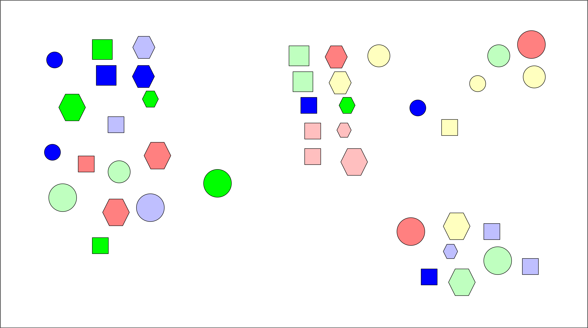

# Análisis de Clusters

El análisis de clusters o grupos, es la tarea de aglutinar conjuntos de objetos
similares (en cierto sentido). Los objetos que pertenecen a un cluster formado
como resultado del análisis, deben ser más similares entre sí que con los
objetos de otros grupos, incluso se desea que la distancia entre los grupos se
lo mayor posible. Es una de las principales tareas de la minería de datos, y el
aprendizaje no supervisado.

Podemos hacer análisis de grupos sin necesidad de programar algoritmos o
utilizar métodos matemáticos ya que el *agrupar objetos* es una de las tareas,
que sin pensar, realizamos todos los días. ¿Como agruparías a los objetos de la
siguiente figura?. Recuerda que se deben agrupar objetos similares. Podemos
agrupar a los objetos, considerando su (a) ubicación, (b) tamaño, (c) color o
algún otro atributo, incluso podemos considerar varias características, por
ejemplo, el color y la figura. En todos estos casos hemos realizado un
*análisis de grupos* sobre las figuras. Una de las preguntas que debemos
hacernos al realizar este tipo de análisis es ¿Cual de las agrupaciones es la
correcta?,para ayudarnos a contestarla se han propuesto varías métricas, pero
mucho depende del contexto de aplicación.

{ width=70% }

{ width=70% }

Si te fijas, esta misma actividad la realizan los científicos para clasificar o
entender distintos fenómenos. Por ejemplo, el estudio de la evolución de las
especies requiere de agrupar animales que tienen características similares. En
la figura siguiente, se muestra un dendograma, donde se agrupan las relaciones
evolutivas entre animales del orden carnívora (imagen del [Instituto de
Biología Canina](https://www.instituteofcaninebiology.org/how-to-read-a-dendrogram.html)),
donde podemos datos interesantes, como que el oso negro es más parecido a una
morsa que a un perro.

](../img/caninebiology.png)

Los métodos matemáticos de análisis de grupos, pueden realizar la misma tarea,
pero en lugar de objetos reales como los animales o figuras, trabajan sobre
datos que representan a los objetos. La representación más común es una matriz
con vectores de datos continuos, categóricos u ordinales. Por ejemplo, las
figuras analizadas anteriormente, pueden ser representadas por la siguiente
matriz:

| id     |  Figura    |Posición  |  Color  | Tamaño      |
|--------|------------|---------:|---------|------------:|
| 1      | Círculo    | 100, 230 | 0000FF  | 50, 50      |
| 2      | Cuadrado   | 430, 450 | CCFFCC  | 70, 70      |
| 3      | Círculo    | 600, 230 | FFFFCC  | 30, 30      |
| 4      | Hexágono   | 300, 330 | 99DDFF  | 30, 30      |
| 5      | Hexágono   | 700, 530 | 0000FF  | 70, 70      |
| 6      | Cuadrado   | 200, 230 | FFFFCC  | 70, 70      |

Los grupos encontrados a partir del análisis de clusters, son potencialmente
*clases o categorías* de objetos: Podemos sugerir que el análisis de grupos es
el descubrimiento de categorías sin necesidad de entrenamiento ya que las
clases pueden extraerse de los datos sin necesidad de que sean asignados
previamente. Cuidado, los algoritmos de análisis de grupos no reemplazan a los
algoritmos de clasificación, ya que las categorías no solo dependen de la
similaridad de ciertas características. Antes de pasar a los algoritmos veamos
primero algunas de las aplicaciones de las técnicas de agrupamiento:

* **Video Juegos** Para los desarrolladores empresas es útil, identificar usuarios con comportamientos similares. Por ejemplo, a partir de capturar el movimiento y actividades de los usuarios, se han identificado tipos de jugadores como: agresivos, cazadores, exploradores,etc. Esta información se utiliza después para hacer cambios en la mecánica del video juego o para dar promociones a otros usuarios.

* **Recuperación de Información** Para mejorar el desempeño de la recuperación de la información, los documentos  
  similares pueden almacenarse cerca unos de otros, mismo servidor, archivo, máquina, etc.

* **Datos Representativos** En lugar de trabajar con todos los datos para realizar algún análisis, se pude trabajar con objetos representatvos de los distintos clusters generados previamente.  
  
* **Cuantificación Vectorial**  A partir de los clusters se pueden obtener vectores característicos. Existen técnicas de compresión como la cuantificación vectorial, que se basan en encontrar vectores característicos para un grupo de objetos similares, así en lugar de almacenar todos los datos de estos objetos, solo se almacena el identificador de su vector característico.

## Clustering basado en prototipos

En este tipo de algoritmo, se tiene un objeto prototipo para cada uno de los grupos. Así la membresía de los objetos a su grupo depende de la similaridad con los prototipos. Para conjuntos de datos continuos, el prototipo es el centroide de todos los objetos que pertenecen al grupo.  

## Clustering basado en densidades

Los grupos se definen como una región de alta densidad rodeada de regiones de baja densidad. 

## Clustering basado en grafos

Los objetos dentro de la estructura de un grafo tienen conexiones intra-grupales pero no conexiones con otros grupos.

## $k$-medias 

El algoritmo de $k$-medias es un algoritmo muy sencillo basado en prototipos.
Solo requerimos especificar el parámetro $k$ donde indicamos el
número de clusters que deseamos obtener. En este algoritmo cada centroide
define a un clúster. El algoritmo es el siguiente: 

1. Se elige de manera aleatoria la posición de los $k$ centroides.

Repetir estos pasos hasta que los centroides no se muevan:

  1. Cada objetos se asigna al centroide más cercano.

  2. Se Recalculan de nuevo los centroides a partir de los objetos que pertenecen a ellos. 

  3. Detener si ninguno cambia de posición, de otro modo continuar el ciclo.

## DBSCAN
